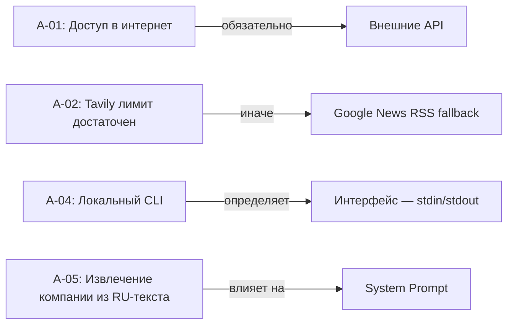

# Business Requirements Document (BRD)

## AI Market Researcher Agent

---

## 1. Executive Summary

Разработка AI-агента для автоматизированного сбора и анализа рыночных данных о компаниях. Система принимает текстовый запрос на естественном языке и возвращает структурированный Markdown-отчет.

**Статус:** Greenfield  
**Бюджет времени:** 2–4 часа на MVP  
**Команда:** 1 разработчик  

---

## 2. Stakeholders

| Stakeholder | Роль | Потребность | Сценарий использования |
|-------------|------|-------------|----------------------|
| Финансовый аналитик | Основной пользователь | Быстрая сводка по компании перед встречей | Запрос → отчет за 30 сек вместо 30 мин ручного сбора |
| Частный инвестор | Основной пользователь | Оценка краткосрочных перспектив перед сделкой | Быстрая проверка конъюнктуры по интересующей бумаге |
| Исследователь / журналист | Вторичный пользователь | Сбор фактуры для статьи или обзора | Получение базового профиля + новостного фона |
| Разработчик | Исполнитель | Реализация MVP в срок 2–4 часа | Четкие требования без ambiguity |

---

## 3. Functional Requirements

Требования Mutually Exclusive: каждое FR описывает ровно одну функцию, которую система **выполняет**.

### FR-01: Прием запроса и извлечение названия компании

| Поле | Значение |
|------|----------|
| **Описание** | Система принимает текстовый запрос и извлекает из него название компании |
| **Приоритет** | Must have |
| **Вход** | Строка произвольного текста (например, «Составь аналитический отчет по компании Apple») |
| **Выход** | Извлеченное название компании (строка) |
| **Edge cases** | Пустой запрос → система запрашивает уточнение; название без контекста → агент определяет намерение самостоятельно |
| **Acceptance Criteria** | Запрос «отчет по Apple» → извлечено "Apple"; запрос «» → сообщение «Укажите название компании» |

### FR-02: Сбор профиля компании

| Поле | Значение |
|------|----------|
| **Описание** | Система собирает описание деятельности, сектор, отрасль, страну, штатную численность, рыночную капитализацию |
| **Приоритет** | Must have |
| **Primary source** | yfinance (`longBusinessSummary`, `sector`, `industry`, `country`, `fullTimeEmployees`, `marketCap`) |
| **Fallback source** | Wikipedia REST API (`extract`) |
| **Edge cases** | Компания не найдена ни в одном источнике → агент сообщает «Компания не найдена», не падает; yfinance не находит тикер → бесшовный переход на Wikipedia |
| **Acceptance Criteria** | Существующая компания → возвращает структурированные поля; несуществующая («Рога и Копыта») → сообщение об ошибке без падения |

### FR-03: Сбор финансовых новостей

| Поле | Значение |
|------|----------|
| **Описание** | Система собирает 2–5 последних новостей с заголовком и кратким содержанием |
| **Приоритет** | Must have |
| **Primary source** | Tavily Search API (запрос `"{company_name} financial news`, `max_results=5`) |
| **Fallback source** | Google News RSS (`title`, `summary`, `published`) |
| **Edge cases** | Tavily недоступен → fallback; новостей нет → возврат пустого списка |
| **Acceptance Criteria** | Компания с новостями → 2–5 записей; компания без новостей → пустой массив, не падение |

### FR-04: Формирование аналитического отчета

| Поле | Значение |
|------|----------|
| **Описание** | Система синтезирует Markdown-отчет из собранных данных |
| **Приоритет** | Must have |
| **Вход** | Профиль компании (FR-02) + новости (FR-03) |
| **Выход** | Структурированный Markdown |
| **Acceptance Criteria** | Отчет содержит: (1) название + сфера деятельности, (2) позитивные факторы, (3) негативные факторы, (4) итоговый вывод (краткосрочные перспективы); все факты — из реальных API (без галлюцинаций) |

#### Спецификация выходного формата

```markdown
# Аналитический отчет: <Company>

## Информация о компании
- **Сфера деятельности:** <описание>
- **Отрасль:** <sector / industry>
- **Страна:** <country>

## Новости и аналитика

### Позитивные факторы
- <news item 1>

### Негативные факторы
- <news item 1>

## Итоговый вывод
<краткосрочный прогноз>
```

---

## 4. Non-Functional Requirements

Требования Mutually Exclusive: каждое NFR описывает **атрибут качества**, а не функцию.

### 4.1. Технические атрибуты

| ID | Атрибут | Требование | Цель | Мотивация |
|----|---------|-----------|------|-----------|
| NFR-01 | **Performance** | Время отклика | ≤ 30 секунд на полный цикл | API-вызовы занимают время, но задача не real-time |
| NFR-02 | **Reliability** | Graceful degradation | При отказе API → бесшовный fallback без потери функциональности | Бесплатные API могут быть недоступны |
| NFR-03 | **Observability** | Логирование шагов | В консоль выводятся: «Думаю...», «Вызываю get_company_profile для X...», «Получил ответ...», «Формирую отчет...» | Прозрачность работы агента |
| NFR-04 | **Security** | Хранение ключей | API-ключи в `.env`, не коммитятся | Базовое требование безопасности |
| NFR-05 | **Extensibility** | Добавление инструментов | Новый инструмент = новый класс/функция, без переписывания ядра | Будут новые источники данных |
| NFR-06 | **Portability** | Стек | Python 3.x, зависимости через pip | Кроссплатформенность |

### 4.2. Ограничения проекта (Constraints)

| ID | Ограничение | Значение |
|----|-------------|----------|
| C-01 | **Срок MVP** | 2–4 часа |
| C-02 | **Бюджет** | $0 (бесплатные API: yfinance, Wikipedia, Google News RSS; Tavily — 1000 запросов/мес) |
| C-03 | **Язык интерфейса** | Русский (промпты, сообщения в консоли) |
| C-04 | **Язык данных** | Английский (данные из внешних API) |
| C-05 | **Инфраструктура** | Локальный запуск, `.env.example` в репозитории, реальные ключи — локально |

---


## 5. Risks & Assumptions

### 5.1. Risks (Collectively Exhaustive)

| ID | Риск | Вероятность | Влияние | Митигация |
|----|------|-------------|---------|-----------|
| R-01 | Tavily API недоступен или превышен лимит | Medium | Medium | Fallback на Google News RSS (NFR-02) |
| R-02 | yfinance не находит тикер по названию | Medium | Low | Fallback на Wikipedia |
| R-03 | API-ключ Tavily скомпрометирован | Low | Medium | `.env` в `.gitignore`, ротация ключа |
| R-04 | Компания не существует ни в одном источнике | Low | Low | Информативное сообщение, graceful handling |
| R-05 | Время вышло (превышен лимит 4 часа) | Medium | High | Приоритет: FR-01 → FR-04 → FR-02 → FR-03 → NFR |

### 5.2. Assumptions

| ID | Допущение | Обоснование |
|----|-----------|-------------|
| A-01 | Пользователь имеет доступ к интернету | Все API удаленные |
| A-02 | Tavily бесплатного тарифа достаточно на этапе разработки | 1000 запросов/мес |
| A-03 | yfinance и Wikipedia не требуют API-ключа | Подтверждено документацией |
| A-04 | Пользователь запускает систему локально (CLI) | MVP — без веб-интерфейса |
| A-05 | Название компании можно извлечь из запроса на русском языке | Prompt-инжиниринг |

### 5.3. Assumption-Architecture Mapping



---

## 6. Success Metrics

| Метрика | Источник данных | Критерий успеха |
|---------|----------------|-----------------|
| **Функциональная полнота** | Чеклист FR | Все 4 FR реализованы и проходят Acceptance Criteria |
| **Время отклика** | Замер (wall clock) | ≤ 30 сек (NFR-01) |
| **Reliability** | Тест fallback | Ручное отключение Tavily → отчет все равно получен через RSS |
| **Graceful error** | Тест неизвестной компании | Агент отвечает текстом, не exception |
| **Observability** | Визуальная проверка | Все 4 шага (NFR-03) видны в консоли |
| **Отсутствие галлюцинаций** | Сверка фактов отчета с API | Все факты в отчете присутствуют в сырых данных инструментов |

---

## 7. Future Scope (Post-MVP)

Строго исключено из MVP. Никакая фича из этого списка не влияет на Acceptance Criteria.

| Направление | Примеры |
|-------------|---------|
| **Новые источники** | Telegram-каналы, SEC EDGAR, Bloomberg API |
| **Форматы экспорта** | PDF, email-рассылка |
| **Режимы работы** | Мониторинг портфеля (ежедневно), сравнение компаний |
| **Пользовательский интерфейс** | Web (Streamlit / Gradio), телеграм-бот |
| **Интернационализация** | EN/DE интерфейс |
| **Персистентность** | История запросов, кастомные шаблоны отчетов |

---

## 8. Glossary

| Термин | Определение | Используется в |
|--------|-------------|----------------|
| **Agent** | AI-система, которая планирует и выполняет вызов инструментов | FR-01, Architecture |
| **Tool** | Функция, вызываемая агентом для получения внешних данных | FR-02, FR-03 |
| **Fallback** | Альтернативный источник при отказе основного | FR-02, FR-03, NFR-02 |
| **Graceful Degradation** | Система продолжает работу (возможно с ограничениями) при отказе компонента | NFR-02 |
| **Markdown** | Легковесный язык разметки | FR-04 |
| **Greenfield** | Проект с нуля, без унаследованного кода | Executive Summary |
| **MVP** | Minimum Viable Product — минимальный набор функций для первого релиза | Executive Summary, Section 8 |
| **Acceptance Criteria** | Условия, при которых требование считается выполненным | Section 3 (FR-01–FR-04) |

---

## Appendix: MECE Mapping

| Секция | MECE-категория | Взаимно исключает | Collectively exhaustive |
|--------|---------------|-------------------|----------------------|
| 1. Executive Summary | Контекст | Не содержит требований | Перечисляет scope: статус, бюджет, команда |
| 2. Stakeholders | Actors | Один stakeholder ≠ другому | Все, кто влияет на requirements |
| 3. Functional Requirements | Что система **делает** | Одна функция ≠ другой функции | Все функции MVP |
| 4. Non-Functional Requirements | **Атрибуты** качества + ограничения | NFR ≠ FR (NFR — как, FR — что) | Все quality attributes + constraints |
| 5. Risks & Assumptions | **Внешние** факторы | Risk ≠ Assumption | Все, что может пойти не так + preconditions |
| 6. Success Metrics | **Измерение** | Метрика проверяется = требование выполнено | Покрывают все FR + NFR |
| 7. Future Scope | **Исключено** из MVP | Ни одна фича не пересекается с FR MVP | Все, что не вошло в MVP |
| 8. Glossary | **Определения** | Термин ≠ другому термину | Все термины, используемые в документе |
