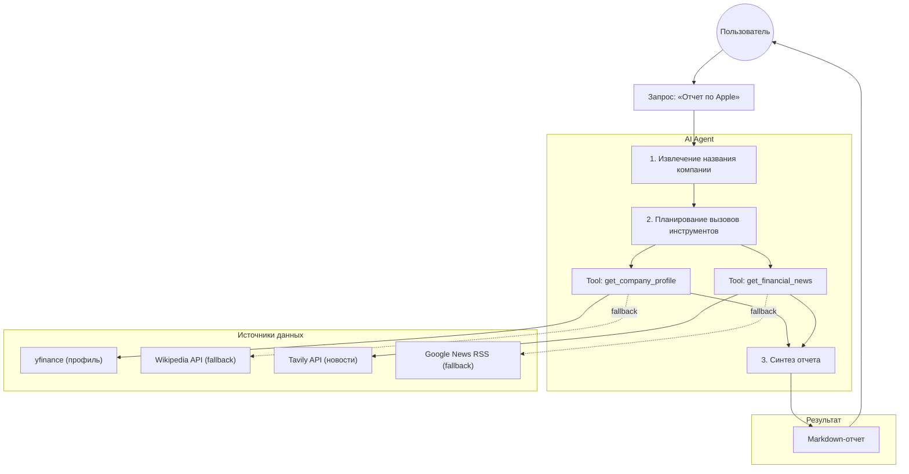
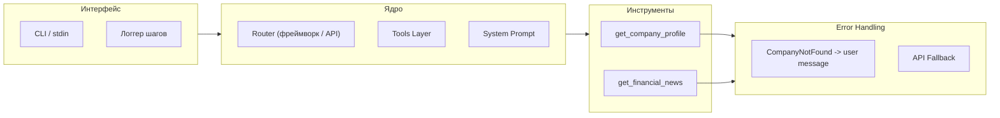
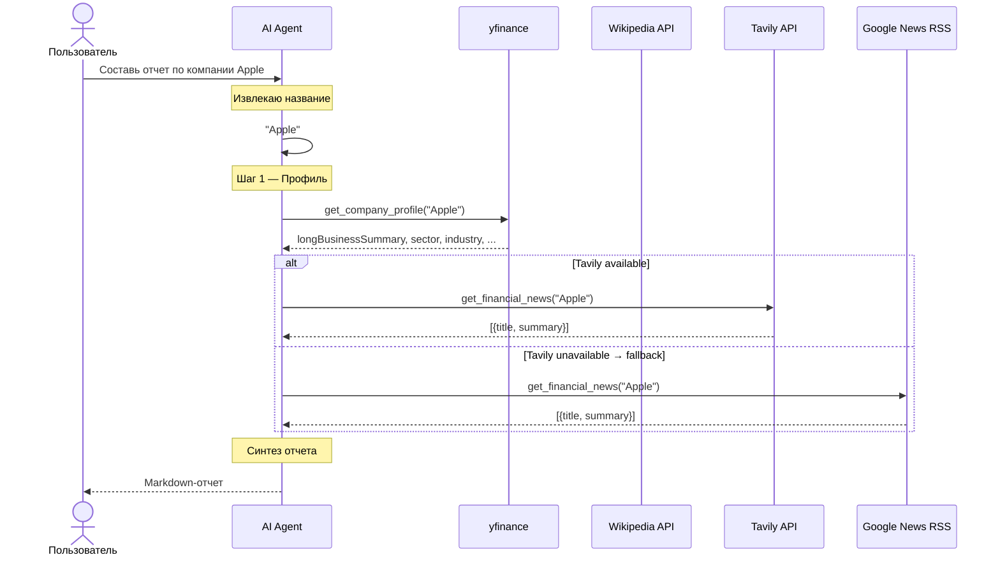

# Tech Stack — AI Market Researcher Agent

Сводка технологических решений, принятых при разработке, с обоснованием выбора и рассмотрением альтернатив.

---

## 1. Язык программирования

| Решение | Обоснование |
|---------|-------------|
| **Python 3.13** |  Требования spec.md — Python. Богатая экосистема для AI/ML. LangGraph и yfinance — Python-first. |

**Связь с BRD:** NFR-06 (Portability), C-01 (срок MVP 2–4 часа)

---

## 2. AI-фреймворк

| Решение | Альтернативы | Обоснование |
|---------|-------------|-------------|
| **LangGraph (`create_react_agent`)** | CrewAI, LangGraph custom graph, чистый Anthropic/OpenAI API, Autogen, ручной ReAct-цикл | `create_react_agent` даёт готовый ReAct-цикл (Thought → Action → Observation) из коробки. Управление историей сообщений, вызов инструментов и проверка `stop_reason` — встроены. Не нужно писать dispatch-цикл вручную. |

**Почему не CrewAI:** CrewAI ориентирован на мультиагентные роли (research → write → review), что избыточно для задачи с 2 инструментами.

**Почему не чистый API:** Пришлось бы вручную реализовывать loop с парсингом tool_use блоков, обработкой `stop_reason` и агрегацией сообщений — LangGraph делает это автоматически.

**Связь с BRD:** FR-01–FR-04, NFR-05 (Extensibility)

---

## 3. LLM-провайдер

| Решение | Альтернативы | Обоснование |
|---------|-------------|-------------|
| **Ollama Cloud (`kimi-k2.6:cloud`)** | Anthropic Claude API, OpenAI GPT API, локальный Ollama (qwen2.5, llama3.1) | Ollama Cloud не требует внешнего API-ключа LLM-провайдера. Модель `kimi-k2.6:cloud` поддерживает tool calling через LangChain `ChatOllama`. Единый endpoint для всех моделей. |

**Альтернативы, отклонённые:**
- **Anthropic Claude** — нужен `ANTHROPIC_API_KEY`, платный
- **OpenAI GPT** — нужен `OPENAI_API_KEY`, платный
- **Локальный Ollama** — зависит от железа, 7B модели хуже справляются с tool calling

**Trade-off:** Ollama Cloud добавляет `OLLAMA_API_KEY` в конфигурацию, но сохраняет совместимость с LangChain. Смена провайдера = замена `ChatOllama` на `ChatAnthropic`/`ChatOpenAI` без изменения остального кода.

**Связь с BRD:** C-02 ($0 budget), NFR-05 (Portability)

---

## 4. Источники данных

### 4.1. Профиль компании

| Уровень | Решение | Альтернатива | Статус |
|---------|---------|-------------|--------|
| **Primary** | **yfinance** | Wikipedia (fallback) | ✅ Выбран |
| **Fallback** | **Wikipedia REST API** (через Search API) | — | ✅ Реализован |

**yfinance:**
- Бесплатно, без API-ключа
- Поля: `longBusinessSummary`, `sector`, `industry`, `country`, `fullTimeEmployees`, `marketCap`, `website`
- Не требует тикера — принимает название компании (с ограничениями: "Apple" → fallback, "AAPL" → прямой ответ)
- **Ограничение:** Для неточных названий (не тикеров) может не найти данные → fallback на Wikipedia

**Wikipedia REST API (fallback):**
- Бесплатно, без API-ключа
- Используется Search API (`/w/api.php?action=query&list=search`) для релевантного поиска, затем `page/summary` для извлечения текста
- **Улучшение vs spec:** В spec указан прямой `/page/summary/{company_name}`, но для "Apple" возвращается описание фрукта, а не компании. Search API решает эту проблему.

**Связь с BRD:** FR-02, R-02 (yfinance не находит тикер → fallback)

### 4.2. Финансовые новости

| Уровень | Решение | Альтернатива | Статус |
|---------|---------|-------------|--------|
| **Primary** | **Tavily Search API** | Google News RSS (fallback) | ✅ Выбран |
| **Fallback** | **Google News RSS** (feedparser) | — | ✅ Реализован |

**Tavily Search API:**
- Запрос: `"{company_name} financial news"`, `max_results=5`
- Результат: заголовок + содержание статьи (структурированные данные)
- Бесплатный тариф: 1000 запросов/месяц
- Требует `TAVILY_API_KEY` в `.env`
- **Ограничение:** Лимит бесплатного тарифа. При превышении → fallback на RSS

**Google News RSS (fallback):**
- Бесплатно, без API-ключа
- URL: `https://news.google.com/rss/search?q={company_name}+stock`
- Поля: `title`, `summary`, `published`
- **Ограничение:** summary содержит HTML-разметку (ссылки, font-теги) — модель извлекает смысл без дополнительной очистки

**Связь с BRD:** FR-03, R-01 (Tavily недоступен → fallback), NFR-02 (Graceful degradation)

---

## 5. Ключевые библиотеки

| Библиотека | Версия | Назначение | Альтернативы |
|-----------|--------|------------|-------------|
| `langgraph` | ≥0.4.0 | ReAct-цикл, управление состоянием | `langgraph` — единственный выбор в связке с LangChain |
| `langchain-ollama` | ≥0.2.0 | Интеграция Ollama с LangChain | `langchain-anthropic`, `langchain-openai` (для других провайдеров) |
| `yfinance` | latest | Финансовый профиль компании | `yfinance` — единственный бесплатный источник |
| `tavily-python` | latest | Поиск новостей | `feedparser` (RSS fallback) |
| `feedparser` | latest | Парсинг RSS | `feedparser` — стандарт для RSS |
| `python-dotenv` | latest | Загрузка `.env` | — |

---

## 6. Архитектура приложения

```
main.py           Точка входа: CLI, загрузка .env
│
├── agent.py      LangGraph create_react_agent: LLM, инструменты, stream
│   │
│   ├── prompts.py      SYSTEM_PROMPT (инструкции для модели)
│   │
│   └── tools.py        2 инструмента как LangChain @tool
│       ├── get_company_profile  yfinance → Wikipedia Search API
│       └── get_financial_news   Tavily → Google News RSS
```

**Поток данных:**
1. `main.py` → загрузка `.env`, парсинг аргументов → вызов `agent.run_agent(query)`
2. `agent.py` → инициализация `ChatOllama` + `create_react_agent` → `agent.stream()`
3. LangGraph управляет ReAct-циклом:
   - LLM (kimi-k2.6:cloud) решает, какой инструмент вызвать
   - LangGraph передаёт аргументы в нужный `@tool`
   - Результат возвращается как `ToolMessage` → `Observation`
   - LLM анализирует → вызывает следующий инструмент или выдаёт финальный ответ
4. `tools.py` → каждая функция реализует primary → fallback → error

**Связь с BRD:** NFR-05 (новый инструмент = новая функция, без переписывания ядра)

### 6.1. High-Level Flow



### 6.2. Component Architecture



### 6.3. Sequence Flow



---

## 7. Схема принятия решений 

| Решение | Критерии | Outcome | Отклонённые варианты |
|---------|----------|---------|---------------------|
| **Язык** | Задание, экосистема | Python | Node.js, Go |
| **Фреймворк** | ReAct-цикл, скорость MVP | LangGraph `create_react_agent` | CrewAI (избыточен), Anthropic API (больше кода) |
| **LLM** | Бесплатно, tool calling | Ollama Cloud + kimi-k2.6:cloud | Claude (платный), OpenAI (платный), локальные 7B (слабее) |
| **Профиль компании** | Бесплатно, доступность | yfinance + Wikipedia fallback | Only yfinance (падает на Apple), Only Wikipedia (меньше полей) |
| **Новости** | Бесплатно, качество | Tavily + RSS fallback | Только Tavily (нет fallback), только RSS (меньше структуры) |
| **Промпт** | Язык, обработка ошибок | Русский SYSTEM_PROMPT в `prompts.py` | Английский промпт (несоответствие) |

---

## 8. Связь с BRD-требованиями

| FR/NFR | Реализация | Компонент |
|--------|-----------|-----------|
| FR-01 (извлечение компании) | LLM + system prompt | `prompts.py`, `agent.py` |
| FR-02 (профиль) | yfinance → Wikipedia | `tools.py`: `get_company_profile` |
| FR-03 (новости) | Tavily → RSS | `tools.py`: `get_financial_news` |
| FR-04 (отчёт) | LangGraph ReAct + Markdown | `agent.py`, `prompts.py` |
| NFR-01 (≤30 сек) | Ollama Cloud | `agent.py` |
| NFR-02 (graceful degradation) | Fallback-цепи | `tools.py` |
| NFR-03 (логирование) | print в tools + INFO | `tools.py`, `agent.py` |
| NFR-04 (безопасность) | `.env`, `.gitignore` | `main.py` |
| NFR-05 (расширяемость) | `@tool`, модульная структура | `tools.py` |

---

*Документ создан на основе `spec.md` (техническое задание) и `brd.md` (бизнес-требования).*
